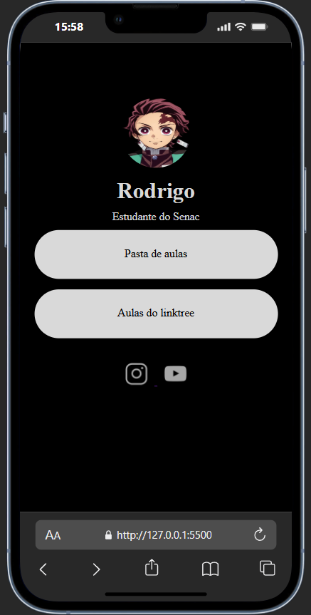

    

# Hub de links
Um projeto minimalista que reproduz o estilo do Linktree usando apenas HTML e CSS. Ideal para portfólios, perfis pessoais e páginas de links rápidas, sem depender de JavaScript ou frameworks.
## Autor
Rodrigo Sousa

